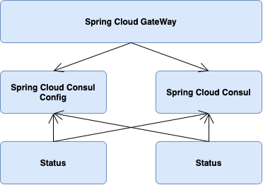
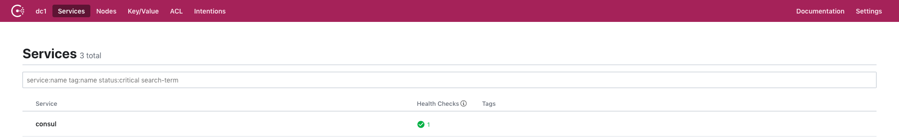
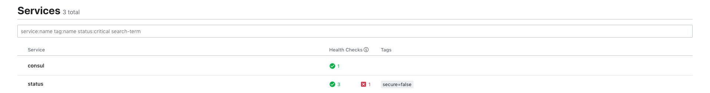
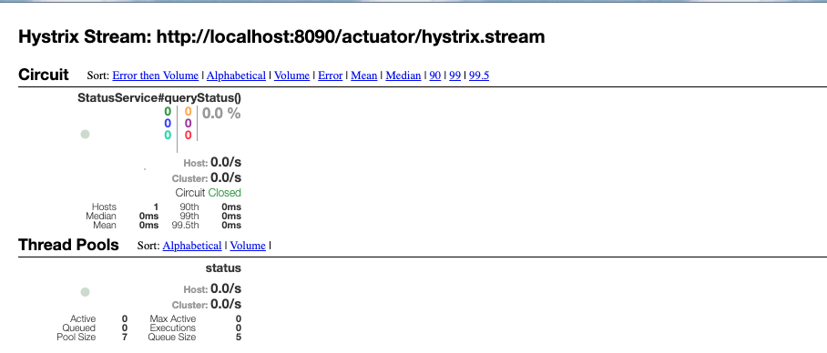

# MCT Project POC

[toc]

### Project Structure

---MCTProjectPOC

​	---api-gateway

​	---status

​	---status-consumer




### Project Setup

1. Create above service, import dependencies and set modules structure in the pom.xml of MCTProjectPOC:

```xml
<dependencies>
        <dependency>
            <groupId>org.springframework.boot</groupId>
            <artifactId>spring-boot-starter</artifactId>
        </dependency>
        <dependency>
            <groupId>com.webex.mct</groupId>
            <artifactId>CommonWrapper</artifactId>
            <version>${commonWrapper.version}</version>
        </dependency>

        <dependency>
            <groupId>org.springframework.boot</groupId>
            <artifactId>spring-boot-starter-web</artifactId>
        </dependency>
        <dependency>
            <groupId>org.springframework.cloud</groupId>
            <artifactId>spring-cloud-starter-consul-config</artifactId>
        </dependency>
        <dependency>
            <groupId>org.springframework.cloud</groupId>
            <artifactId>spring-cloud-starter-consul-discovery</artifactId>
        </dependency>
        <dependency>
            <groupId>org.springframework.boot</groupId>
            <artifactId>spring-boot-starter-actuator</artifactId>
        </dependency>
        <dependency>
            <groupId>org.springframework.cloud</groupId>
            <artifactId>spring-cloud-starter-openfeign</artifactId>
        </dependency>
        <dependency>
            <groupId>org.springframework.cloud</groupId>
            <artifactId>spring-cloud-starter-hystrix</artifactId>
        </dependency>
        <dependency>
            <groupId>org.springframework.cloud</groupId>
            <artifactId>spring-cloud-starter-hystrix-dashboard</artifactId>
        </dependency>
        <dependency>
            <groupId>org.springframework.cloud</groupId>
            <artifactId>spring-cloud-starter-netflix-hystrix</artifactId>
        </dependency>
        <dependency>
            <groupId>org.springframework.cloud</groupId>
            <artifactId>spring-cloud-starter-netflix-hystrix-dashboard</artifactId>
        </dependency>

        <dependency>
            <groupId>org.springframework.boot</groupId>
            <artifactId>spring-boot-starter-test</artifactId>
            <scope>test</scope>
            <exclusions>
                <exclusion>
                    <groupId>org.junit.vintage</groupId>
                    <artifactId>junit-vintage-engine</artifactId>
                </exclusion>
            </exclusions>
        </dependency>
    </dependencies>

    <modules>
        <module>status</module>
        <module>status-consumer</module>
        <module>api-gateway</module>
    </modules>

```

2. Install Spring Cloud Consul server:

   Guide: https://learn.hashicorp.com/consul/getting-started/install.html

   Verify: visit ip:8500 and see if UI like:

   

3. (Optional)Set application name and server port in application.yml(or application.properties, depends on you):

   ```yaml
   spring:
     application:
       name: status
   
   server:
     port: 8080
   ```

   (Required)Create a new config file in the same level of application.yml called bootstrap.yml(fixed name) and setting like:

   ```yaml
   spring:
     cloud:
       consul:
         host: ${your consul server ip}
         discovery:
           service-name: ${spring.cloud.name}
           instance-id: ${spring.cloud.consul.discovery.service-name}-${spring.cloud.client.ip-address}-${server.port}
       name: status
   ```

   Start status server and check in consul page:

   

   Status service registered in consul successfully.

4. (Optional)Register status-consumer service in consul as well like step 3. 

   server.port/spring.cloud.consul.discovery.service-name must be different with what it is in Status service.

5. Set up basic service in status service:

   ```java
   @RestController
   @RequestMapping("/status")
   public class StatusController {
   
       @RequestMapping("/get")
       public ServerFullStatus getStatus(){
           return new ServerFullStatus();
       }
   
   }
   ```

6. Use feign to visit Status Service

   Write a new class in status-consumer service called StatusService and code like:

   ```java
   @FeignClient(value = "status")
   @RequestMapping("/status")
   public interface StatusService {
   
       @RequestMapping("/get")
       ServerFullStatus queryStatus();
   }
   ```

   Write a controller in status-consumer service to visit status service:

   ```java
   @RestController
   @RequestMapping("/consumer")
   public class StatusController {
   
       @Autowired
       private StatusService statusService;
   
       @RequestMapping("/status")
       public ServerFullStatus getFullStatus() {
           return statusService.queryStatus();
       }
   
   }
   ```

   Restart status/status-consumer service and visit {your status-consumer ip}: {your status-consumer port}/consumer/status.

   Result should be like:

   ```json
   {
       "statusId": 0,
       "status": 0,
       "time": null,
       "comments": null,
       "clusterId": 0,
       "domainId": 0,
       "zoneId": 0,
       "serverId": 0,
       "serverType": 0,
       "statusHourPos": 0,
       "statusProtocol": 0,
       "latencyId": 0,
       "latency": 0,
       "severity": 0,
       "source": 0,
       "userName": null,
       "stamp": null,
       "resultType": 0,
       "sessionId": null,
       "subStatusCount": 0,
       "statusUID": "",
       "tick": 0,
       "retry": 0,
       "orgId": 0,
       "agentId": 0,
       "metrics": null,
       "pollingPid": 0,
       "pid": 0,
       "logFileName": null,
       "maintainStatus": false,
       "forceMaintainStatus": false,
       "onPremStatus": false,
       "gastatus": false
   }
   ```

7. Enable Hystrix

   nable hystrix in application.yml of status-consumer

   ```yaml
   feign:
     hystrix:
       enabled: true
   ```

   Update code in StatusService like:

   ```java
   @FeignClient(value = "status", fallbackFactory = StatusFallback.class)
   @RequestMapping("/status")
   public interface StatusService {
   
       @RequestMapping("/get")
       ServerFullStatus queryStatus();
   }
   ```

   Add StatusFallback class:

   ```java
   @Component
   public class StatusFallback implements FallbackFactory<StatusService> {
   
       @Override
       public StatusService create(Throwable throwable) {
           return () -> {
               ServerFullStatus serverFullStatus = new ServerFullStatus();
               serverFullStatus.setAgentId(1111);
               return serverFullStatus;
           };
       }
   }
   ```

   Restart status-consumer service and shut down status service. Then visit the same url again, result should be like:

   ```json
   {
       "statusId": 0,
       "status": 0,
       "time": null,
       "comments": null,
       "clusterId": 0,
       "domainId": 0,
       "zoneId": 0,
       "serverId": 0,
       "serverType": 0,
       "statusHourPos": 0,
       "statusProtocol": 0,
       "latencyId": 0,
       "latency": 0,
       "severity": 0,
       "source": 1111,
       "userName": null,
       "stamp": null,
       "resultType": 0,
       "sessionId": null,
       "subStatusCount": 0,
       "statusUID": "",
       "tick": 0,
       "retry": 0,
       "orgId": 0,
       "agentId": 1111,
       "metrics": null,
       "pollingPid": 0,
       "pid": 0,
       "logFileName": null,
       "maintainStatus": false,
       "forceMaintainStatus": false,
       "onPremStatus": false,
       "gastatus": false
   }
   ```

   As you can see, the source and agentId have been changed because status service is unavailable now.

8. Hystrix Monitor

   Add setting in bootstrap.yml of status-consumer:

   ```yaml
   management:
     endpoints:
       web:
         exposure:
           include: 'hystrix.stream'
   ```

   Visit http://{your status-consumer ip}:{your status-consumer port}/actuator/hystrix.stream, check the data stream. (Make sure to visit a controller after opening the page)

   Visit http://localhost:8090/hystrix and paster the link you just visited here. Check hystrix monitor dashboard.

   

